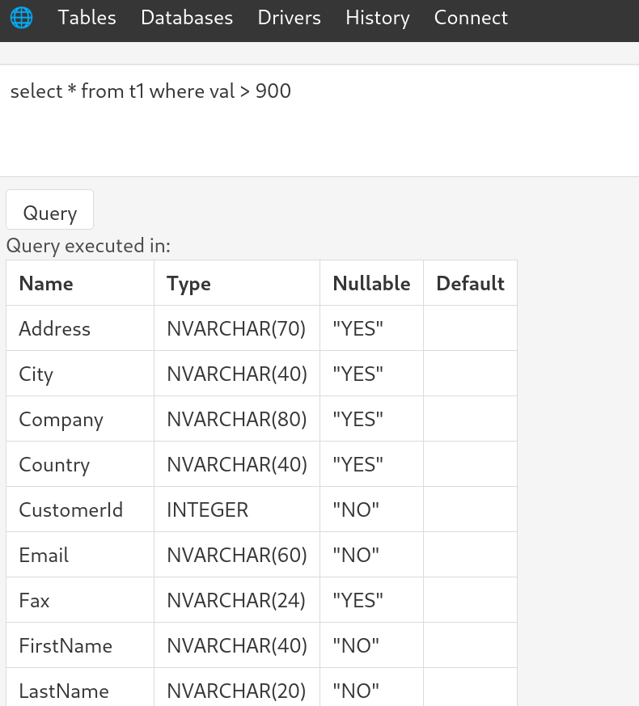

# SQL UI: Universal SQL query runner and data browser

`sqlui` is query runner and data browser supporting many databases supported by [usql](https://github.com/xo/usql). `sqlui` starts server on [localhost](http://localhost:9292/) by default that can be visited in web browser. `sqlui` supports following features:
* Ability to see available tables and table schema
* Ability to browse table rows and quick search table text fields. 
* Query runner that keeps history of queries executed.
* Sample demo available at: [https://sqlui.onrender.com/](https://sqlui.onrender.com/)

https://user-images.githubusercontent.com/7593807/170309052-98615e4b-299e-4173-9d1c-c7428def78a5.mov

## Supported Databases
Supported databases depends on the tag `sqlui` is built with. See [usql](https://github.com/xo/usql) for details of available tags to compile customized version. `Drivers` page lists supported database drivers that are compiled into. Drivers in precompiled binaries depend on the tag of the package. Download binary with appropriate tag. Binaries with static in tag are compiled as static binaries without any libc dependencies.

* `default`: cockroachdb  memsql  mysql oracle  postgres  redshift  sqlite3 sqlserver tidb  vitess  
* `default-static`: cockroachdb moderncsqlite(sqlite alternative)  memsql  mysql oracle  postgres  redshift  sqlserver tidb  vitess  
* `most`: adodb athena  avatica bigquery  clickhouse  cockroachdb cql csvq  exasol  firebirdsql genji h2  hdb ignite  maxcompute  memsql  moderncsqlite mymysql mysql n1ql  nzgo  oleodbc oracle  pgx postgres  presto  ql  redshift  spanner sqlite3 sqlserver tds tidb  trino vertica vitess  voltdb 
* `most-static`: adodb athena  avatica bigquery  clickhouse  cockroachdb cql csvq  exasol  firebirdsql genji h2  hdb ignite  maxcompute  memsql  moderncsqlite mymysql mysql n1ql  nzgo  oleodbc oracle  pgx postgres  presto  ql  redshift  spanner sqlserver tds tidb  trino vertica vitess  voltdb 

